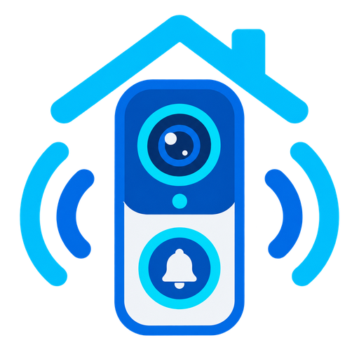

# LSC Tuya Doorbell — Home Assistant integration



Local control for LSC Smart Connect and other Tuya-based video doorbells. The
integration talks to the doorbell over your own network with the Tuya local
protocol: no cloud account, no polling of Tuya's servers, no data leaving the
LAN.

Version 3.0 is a rebuild of how the integration decides what a device *is*.
Before, it assumed the datapoint numbers of one LSC model with one firmware; if
your doorbell used different ones, it connected happily and then did nothing at
all. It now learns which datapoint does what, and you tell it which one is the
button. See [CHANGELOG.md](CHANGELOG.md) for the full list, and
[Upgrading](CHANGELOG.md#upgrading) if you already run 2.x.

---

## Contents

- [Requirements](#requirements)
- [Installation](#installation)
- [Setting up a device](#setting-up-a-device)
- [Datapoints and roles](#datapoints-and-roles) — start here if nothing happens when you ring
- [Entities](#entities)
- [Snapshots](#snapshots)
- [go2rtc and other restreamers](#go2rtc-and-other-restreamers)
- [Options reference](#options-reference)
- [Events](#events)
- [Automation examples](#automation-examples)
- [Services](#services)
- [Troubleshooting](#troubleshooting)
- [What this integration does not do](#what-this-integration-does-not-do)
- [Known datapoint tables](#known-datapoint-tables)
- [Project layout](#project-layout)

---

## Requirements

- Home Assistant **2025.3** or newer. The entity platforms use
  `AddConfigEntryEntitiesCallback`, which Home Assistant added in 2025.3.
- An LSC Smart Connect video doorbell, or another Tuya device speaking local
  protocol **3.3**, **3.4** or **3.5**.
- The device's **device ID** and **local key** (see
  [Finding your device ID and local key](#finding-your-device-id-and-local-key)).
- `ffmpeg` on the Home Assistant host for snapshots. Home Assistant OS and the
  official container ship it; a venv install may not.
- No Python dependencies. The protocol implementation uses `cryptography`, which
  Home Assistant already pins.

## Installation

### HACS

1. Open HACS.
2. Three-dot menu → **Custom repositories**.
3. Add `https://github.com/jurgenmahn/ha_tuya_doorbell` with category
   **Integration**.
4. Search for *LSC Tuya Doorbell*, download it.
5. Restart Home Assistant.

### Manual

Copy `custom_components/lsc_tuya_doorbell` into your Home Assistant
`custom_components` directory and restart.

## Setting up a device

**Settings → Devices & Services → Add Integration → LSC Tuya Doorbell.**

1. **Setup method** — *Search the network for devices* or *Enter the details
   myself*.
   - Searching listens for Tuya UDP broadcasts on ports 6666 and 6667 for up to
     ten seconds. Devices announce themselves every few seconds, so the search
     stays open a little longer than the first reply. Devices you have already
     configured are filtered out and counted separately.
   - Manual entry asks for IP address, device ID, port (default `6668`) and
     protocol version.
2. **Device Credentials** — the 16-character local key, a device name, and
   optionally the ONVIF/RTSP password.
3. The connection is tested before the entry is created.

A new entry starts without a datapoint profile: the integration connects, but it
does not yet know what any datapoint on your device means. **Continue with
[Datapoints and roles](#datapoints-and-roles)** — that step is not optional, and
it is the one everybody has to go through.

### About the protocol version

A Tuya device announces a protocol version in its broadcast, and that version is
frequently not the one it actually speaks. The setup form therefore preselects
it as an **editable** field and says where the value came from. If the handshake
fails, the other supported versions are tried automatically and the one that
worked is the one that gets stored — the log says which.

### If the local key changes

Tuya rotates the local key whenever a device is paired again in the Tuya or
Smart Life app. When that happens the integration starts a **reauthentication**
flow: enter the new key and everything else — entity IDs, history, automations —
stays as it was. There is also a **reconfigure** flow for changing the IP
address, port or protocol version of an existing entry.

## Datapoints and roles

This is the part that decides whether the integration does anything at all.
Read it once.

A Tuya device exposes numbered **datapoints** (DPs). DP 101 might be the
recording switch, DP 185 might be the doorbell button. *Might*: the numbers
differ per model and per firmware generation, and even the same model changes
them across firmware revisions. The v4 and v5 firmware of the same LSC doorbell
disagree about DP 109, 110 and 134 — one calls 110 "SD Card Status", the other
"Basic OSD".

Version 2.x hardcoded DP 185 (button), 115 (motion) and 101 (record switch). On
the model it was written for, that guess was right, which is exactly why it
looked like it worked. Everywhere else it produced entities wired to datapoints
the device never sends, while the real ones were never found.

So the integration no longer guesses. It reads **roles**:

| Role | What it drives |
|---|---|
| `doorbell_button` | The button-press event, the doorbell event entity, the snapshot |
| `motion` | The motion event and motion entity |
| `record_switch` | The recording switch, including the *auto-enable* recovery option |

A role points at whichever datapoint holds it *on your device*. A role nobody
claims means that behaviour is **off** — there is no fallback to a number,
because falling back to a number is what broke this. When no datapoint claims
`doorbell_button`, Home Assistant raises a repair issue that points you at the
live capture.

### Finding your datapoints with live capture

An event datapoint cannot be found by asking the device for it: it only carries
a value at the moment somebody presses the button. It has to be *watched* for.

**Settings → Devices & Services → LSC Tuya Doorbell → Configure → Live capture
(find button and motion datapoints)**

The capture listens on the connection that is already open and runs until you
stop it:

1. Start the capture. The screen shows how long it has been running, which
   datapoints it has seen, and which of them behave like events (marked `⟳` —
   they reported more than one value).
2. **Press the doorbell.** Watch which datapoint appears.
3. **Walk in front of the camera** to trigger motion detection.
4. **Work through the Tuya or Smart Life app**: flip the night-vision setting,
   change the volume, toggle recording. Every control you touch reveals its
   datapoint.
5. Press **Submit** to refresh the screen whenever you want to see what has been
   found so far. The session keeps running.
6. Tick **Done — stop capturing** when you have triggered everything.
7. **Capture Results** — pick the datapoints to keep.
8. **Assign Roles** — say which datapoint is the doorbell button, which is
   motion, and which is the recording switch. Leave a role empty and it stays
   off.

Nothing is written to the device profile until you have made that last choice.

### Scanning for datapoints

**Configure → Scan for datapoints** asks the device for every datapoint it will
answer for, DP 1 through 255, in batches. It takes up to two minutes and you can
close the dialog while it runs; the results are waiting when you come back.

The scan finds settings — switches, selects, numbers, sensors. It **cannot**
find the doorbell button or motion detection, because those carry a value only
while the event is happening. The scan says so rather than adding them anyway,
which is what version 2.x did.

Results are presented for you to pick from, and then run through the same
**Assign Roles** step. As with the capture, nothing is stored before you choose.

### Editing datapoints by hand

**Configure → Manage datapoints** lists what is in the profile and lets you
rename a datapoint, change which entity type it becomes, delete it, or add one
by number if you know it.

## Entities

Entities are created from the device profile — from what your device actually
reports. A device without a profile gets no datapoint entities at all, and says
so in the log, instead of inventing them.

| Platform | Created for | Notes |
|---|---|---|
| `event` | Datapoints marked as events, or holding the `doorbell_button` / `motion` role | Event types `ring` and `motion`; device class `doorbell` for the button. This is what Home Assistant's own doorbell automations expect. |
| `binary_sensor` | Datapoints with entity type *binary sensor* | Momentary state with an auto-reset timer (5 s). Kept alongside the event entity because history and existing automations hang off it. |
| `switch` | Boolean datapoints | Record switch, indicator light, chime switch, … |
| `select` | Enum datapoints | Night vision, motion sensitivity, recording mode, … |
| `number` | Integer datapoints with bounds | Volumes |
| `sensor` | Read-only datapoints | SD storage info, SD card status (status codes are translated through the datapoint's value map) |
| `camera` | Created when a stream URL **or** a still-image URL is available | An ONVIF password is no longer required for the camera to appear |
| `binary_sensor` | Always: **Connected** | Diagnostic, device class `connectivity` |

Every entity subscribes to connection changes, so all of them go unavailable
when the doorbell does. In 2.x only the *Connected* sensor noticed, and the rest
kept showing their last value indefinitely.

The doorbell binary sensor carries these attributes: `dp_id`, `role`,
`event_counter`, `last_image_url` and `last_snapshot_url`. The event counter is
held by the hub, so the number in the attribute and the number in the fired
event are the same one.

## Snapshots

### Why there are four modes

Grabbing a still from an RTSP camera on demand is slow, and the reason is not
the network. Measured against a real LSC doorbell:

| How the picture is fetched | Measured |
|---|---|
| ffmpeg grab straight from the camera | 5.86 s |
| the same grab, with a second one already running | 15.94 s |
| go2rtc `frame.jpeg`, source already warm | 1.82 – 3.09 s |
| continuous ffmpeg writing a rolling JPEG | 1.00 s, flat |

The trace shows the keyframe is decoded after about one second; ffmpeg then
spends another five to six seconds inside `avformat_find_stream_info()`. No flag
shortens that — `-analyzeduration`, `-probesize`, `-fflags nobuffer`,
`-allowed_media_types` and going through a restreamer were all measured, and none
of them helped. Any design that starts a process per event pays that cost. The
16-second figure is what happens when a second press arrives while the first
grab still holds an RTSP session open: these cameras only tolerate a handful of
simultaneous sessions and get slower as you add them.

### The modes

| Mode | What it does | Can look back | Needs |
|---|---|---|---|
| `off` | No snapshots. | no | — |
| `on_demand` | Fetches the still-image URL if configured, otherwise starts one ffmpeg per grab. The 2.x behaviour, and the **default**, because it needs no configuration and works anywhere. | no | nothing |
| `warm` | One ffmpeg holds the stream open and keeps a rolling JPEG on disk. A grab is a file read. | no | a stream source |
| `buffer` | One ffmpeg writes keyframe-aligned `-c:v copy` segments into a ring buffer on tmpfs. A grab seeks into the segment covering the wanted moment. | **yes** | a stream source and a writable tmpfs path |

Configure them under **Configure → Snapshot settings**.

When a continuous mode cannot deliver — the buffer is still filling, the rolling
JPEG has gone stale — the provider falls back to the on-demand path and says so
in its status, rather than returning nothing. It only ever spawns that second
ffmpeg when no long-running one is connected, so the fallback cannot cause the
session contention it exists to avoid.

### Looking back in time

The doorbell reports a button press three to five seconds after it happened. A
picture of "now" therefore shows the visitor already walking away.

**Look back by** (`snapshot_delay_ms`, 0 – 8000 ms) subtracts that delay before
picking a frame. Only `buffer` mode can honour it: the other modes have nothing
older than the current frame, and they ignore the setting rather than pretending
otherwise. Start around 3000 ms and adjust.

### Sizing the buffer directory

The default buffer path is `/dev/shm/lsc_tuya_doorbell`. `/dev/shm` is RAM, so
segments never touch your SD card or SSD.

Docker gives a container **64 MB** of `/dev/shm` by default. At roughly 2 Mbit/s
a doorbell stream costs about **15 MB per minute**, and the provider asks for a
25% margin on top because bitrate spikes on motion:

| Buffer length | Roughly |
|---|---|
| 60 s (default) | ~15 MB |
| 120 s | ~30 MB |
| 300 s (maximum) | ~75 MB |

Raise it with `shm_size`:

```yaml
services:
  homeassistant:
    image: ghcr.io/home-assistant/home-assistant:stable
    shm_size: "256mb"
    volumes:
      - /path/to/config:/config
    network_mode: host
    restart: unless-stopped
```

The provider checks the free space when it starts and logs a warning naming the
path and the shortfall if it is tight, instead of failing silently once the
filesystem fills up. Home Assistant OS and Supervised installs generally have a
large enough `/dev/shm` already; if not, point the buffer path at another tmpfs.

### Where snapshots end up

A picture that has been taken is written to the **Snapshot save directory**
(default `/config/www/doorbell`), named `<device-slug>_<timestamp>.jpg`. Only
the ten most recent files per device are kept.

Home Assistant serves `<config>/www` as `/local`, so a file in the default
location is reachable at `/local/doorbell/<file>.jpg` and that URL appears in
the event payload. Point the directory somewhere outside `<config>/www` and the
events carry `snapshot_path` but a `null` `snapshot_url`, with one warning in
the log explaining why.

### The order of things

The press never waits for the picture:

1. `t=0` — entity callbacks fire and the binary sensor turns on.
2. `t=0` — the event fires, with `snapshot_url` present and `null`.
3. When the image arrives — the sensor attribute is updated and a second event,
   `lsc_tuya_doorbell_snapshot_ready`, fires with the URL filled in.

In `warm` and `buffer` mode step 3 follows within about a second. In `on_demand`
it can be five or more.

## go2rtc and other restreamers

These cameras get confused by several simultaneous RTSP sessions — that is what
the 15.94 s measurement above is. Home Assistant's stream, a snapshot grab,
HomeKit and a detection service add up to four connections fast.

A restreamer such as [go2rtc](https://github.com/AlexxIT/go2rtc) keeps **one**
connection to the doorbell and fans it out. Configure it under **Configure →
Camera settings**:

| Setting | Value |
|---|---|
| **Stream URL override** | The restreamer's RTSP URL, e.g. `rtsp://192.168.1.10:8554/doorbell` |
| **Still image URL override** | `http://192.168.1.10:1984/api/frame.jpeg?src=doorbell` |

Both are used everywhere: the camera entity, the snapshot provider, and the
continuous ffmpeg in `warm` and `buffer` mode. (In 2.x the snapshot code rebuilt
its own URL from host, port and path, which is how a fourth session ended up on
the camera even when an override was set.)

If you already run Frigate, point its `ffmpeg.inputs` at the same restream, or
point this integration's stream URL override at whatever Frigate is already
pulling from.

## Options reference

**Configure** opens a menu:

| Menu item | Contains |
|---|---|
| **Connection settings** | IP address, port, protocol version |
| **Camera settings** | ONVIF/RTSP credentials, port, stream path, snapshot directory, auto-enable record switch, snapshot trigger datapoints, stream URL override, still image URL override |
| **Snapshot settings** | Snapshot mode, buffer directory, buffer length, look back by |
| **Manage datapoints** | Edit, add and remove datapoints |
| **Scan for datapoints** | Full DP 1-255 scan |
| **Live capture (find button and motion datapoints)** | Watch the device while you trigger things |

### Camera settings

| Setting | Default | Description |
|---|---|---|
| ONVIF/RTSP username | `admin` | Used in the RTSP URL built from host, port and path |
| ONVIF/RTSP password | *(empty)* | Same. A password in a URL is escaped |
| RTSP port | `8554` | |
| RTSP stream path | `/Streaming/Channels/101` | Channel 101 is the main stream |
| Snapshot save directory | `/config/www/doorbell` | Below `<config>/www` to get a `/local/` URL |
| Auto-enable the record switch | off | Some Tuya devices turn recording — and with it ONVIF — off by themselves. This pushes it back on after two seconds |
| Take a snapshot when these datapoints fire | *(empty)* | Empty means: whichever datapoint holds the `doorbell_button` role. Only datapoints your device actually reports are listed |
| Stream URL override | *(empty)* | Replaces the URL built from host/port/path |
| Still image URL override | *(empty)* | An HTTP URL returning a single JPEG |

### Snapshot settings

| Setting | Default | Range |
|---|---|---|
| Snapshot mode | `on_demand` | `off`, `on_demand`, `warm`, `buffer` |
| Buffer directory | `/dev/shm/lsc_tuya_doorbell` | any writable path, preferably tmpfs |
| Buffer length | 60 s | 5 – 300 s |
| Look back by | 0 ms | 0 – 8000 ms, `buffer` mode only |

## Events

Every device event now fires under **two** names:

```
lsc_tuya_doorbell_button_press              <- stable, use this
lsc_tuya_doorbell_button_press_front_door   <- deprecated
```

The suffixed form contains a slug of the device name, and the device name is
editable — so renaming a device silently broke every automation built on it. The
stable name carries `device_id` in the payload; filter on that when you have more
than one doorbell. The suffixed events keep firing for now, but they are
deprecated and will be removed in a future major version.

| Event | Fires when | Slug variant |
|---|---|---|
| `lsc_tuya_doorbell_button_press` | The datapoint holding the `doorbell_button` role reports | yes |
| `lsc_tuya_doorbell_motion_detect` | The datapoint holding the `motion` role reports | yes |
| `lsc_tuya_doorbell_dp_event` | A datapoint marked as an event that holds no role reports | yes |
| `lsc_tuya_doorbell_snapshot_ready` | A picture for a preceding event has been stored | yes |
| `lsc_tuya_doorbell_ip_changed` | The device was rediscovered at another address (`old_ip`, `new_ip`) | yes |
| `lsc_tuya_doorbell_connected` | The connection came up | no |
| `lsc_tuya_doorbell_disconnected` | The connection went down | no |
| `lsc_tuya_doorbell_dp_discovered` | An in-integration datapoint scan finished (`dp_count`, `dp_ids`) | no |
| `lsc_tuya_doorbell_dp_scan_results` | The `discover_datapoints` or `monitor_datapoints` service finished (`source`, `count`, `dps`) | no |

### Payload

`button_press`, `motion_detect`, `dp_event` and `snapshot_ready` all carry the
same keys. Every key is always present — a field you have to test for is a field
that breaks an automation the first time it is left out:

| Field | Description |
|---|---|
| `device_id` | Tuya device ID |
| `device_name` | Configured device name |
| `timestamp` | ISO timestamp |
| `dp_id` | The datapoint that fired |
| `role` | The role that datapoint holds, or `null` |
| `event_counter` | Running count for this datapoint since the entry was loaded |
| `raw_value` | The reported value |
| `image_url` | Tuya cloud image URL if the payload contained one, else `null` |
| `snapshot_url` | `/local/` URL of the stored picture. Always `null` on the first event; filled in on `snapshot_ready` |
| `snapshot_path` | Absolute path of the stored picture, or `null` |

`dp_scan_results` and `dp_discovered` have their own shapes. In 2.x these two
shared one event name with two different payloads, so an automation listening
for it received whichever shape happened to arrive.

## Automation examples

### Notify on a press, with the picture

Trigger on the stable event name, then wait for the picture:

```yaml
automation:
  - alias: "Doorbell notification with snapshot"
    triggers:
      - trigger: event
        event_type: lsc_tuya_doorbell_snapshot_ready
        event_data:
          device_id: bfxxxxxxxxxxxxxxxxxxxx
          role: doorbell_button
    actions:
      - action: notify.mobile_app_phone
        data:
          title: "Doorbell"
          message: "Press #{{ trigger.event.data.event_counter }}"
          data:
            image: "{{ trigger.event.data.snapshot_url }}"
```

### Notify immediately, picture or not

`snapshot_ready` only fires when a picture was produced. If you would rather be
told at once, trigger on the press itself — `snapshot_url` will be `null`:

```yaml
automation:
  - alias: "Doorbell notification, immediate"
    triggers:
      - trigger: event
        event_type: lsc_tuya_doorbell_button_press
    actions:
      - action: notify.mobile_app_phone
        data:
          title: "Doorbell"
          message: "Someone is at the {{ trigger.event.data.device_name }}"
```

### Trigger on the event entity

The event entity is the Home Assistant-native route and needs no event names at
all:

```yaml
automation:
  - alias: "Doorbell via event entity"
    triggers:
      - trigger: state
        entity_id: event.front_door_doorbell_button
    actions:
      - action: light.turn_on
        target:
          entity_id: light.hallway
```

### Motion-activated porch light

```yaml
automation:
  - alias: "Porch light on motion"
    triggers:
      - trigger: event
        event_type: lsc_tuya_doorbell_motion_detect
    conditions:
      - condition: sun
        after: sunset
    actions:
      - action: light.turn_on
        target:
          entity_id: light.porch
        data:
          brightness_pct: 100
      - delay: "00:02:00"
      - action: light.turn_off
        target:
          entity_id: light.porch
```

### Offline alert

```yaml
automation:
  - alias: "Doorbell offline alert"
    triggers:
      - trigger: event
        event_type: lsc_tuya_doorbell_disconnected
    actions:
      - action: persistent_notification.create
        data:
          title: "Doorbell offline"
          message: "Lost connection at {{ now().strftime('%H:%M') }}"
```

The **Connected** binary sensor covers the same ground as a state trigger, and
survives a restart.

## Services

| Service | Description |
|---|---|
| `lsc_tuya_doorbell.discover_devices` | Search the network for Tuya devices |
| `lsc_tuya_doorbell.discover_datapoints` | Run a full DP 1-255 scan on one device and fire `dp_scan_results` |
| `lsc_tuya_doorbell.export_dp_profile` | Write the device profile as JSON to the log |
| `lsc_tuya_doorbell.monitor_datapoints` | Passively watch a device for datapoint updates for a given duration |
| `lsc_tuya_doorbell.add_datapoint` | Add a datapoint to a profile (reloads the entry) |
| `lsc_tuya_doorbell.remove_datapoint` | Remove a datapoint from a profile (reloads the entry) |

All services take `device_id` — the Tuya device ID, not the Home Assistant device
registry ID. They are registered once for the integration and validated against a
schema, so a missing field is reported instead of raising somewhere deeper.

The services are useful for scripted debugging; the options flow does everything
they do, with the results shown on screen.

## Troubleshooting

Turn on debug logging first:

```yaml
logger:
  logs:
    custom_components.lsc_tuya_doorbell: debug
```

The integration now says what is wrong rather than going quiet. A CRC mismatch,
an HMAC mismatch, a failed decrypt, invalid padding, a frame with an impossible
length, a lost connection that did not come back, a snapshot that could not be
taken, a buffer path that is nearly full — all of them reach the log at warning
level, throttled to one message per state change per kind so a persistently
broken device cannot drown everything else, with a note when the problem clears.

### Setup errors

| Message | What it means |
|---|---|
| *The device rejected this local key.* | Wrong local key. Look it up again — Tuya changes it whenever a device is re-paired. In 2.x this case was invisible and came out as "cannot connect", which sent people to inspect their network. |
| *A local key is exactly 16 characters.* | The field content is the wrong length; you probably pasted a device ID or a UUID. |
| *The device accepted the connection but never answered.* | The TCP connection works and the handshake does not. Almost always the local key. |
| *The device speaks a Tuya protocol version this integration does not support.* | Protocol 3.1 or 3.2. See [what this integration does not do](#what-this-integration-does-not-do). |
| *The device's reply could not be decrypted.* | Either the key or the protocol version is wrong. Leave the version at 3.3 and let the automatic retry find the right one. |
| *The device sent something this integration could not read.* | A frame failed to parse. The log names it. |
| *Could not reach the device.* | Genuinely a network or address problem now that the cases above have their own messages. |
| *The device did not answer in time.* | Asleep, busy streaming, or on poor Wi-Fi. |
| *Discovery could not run.* | The UDP listener could not start. Add the device manually with its IP and device ID. |

### The doorbell connects but pressing it does nothing

No datapoint holds the `doorbell_button` role. This is the common case on a
model other than the one the integration was originally written for. Home
Assistant shows a repair issue saying so; the fix is a
[live capture](#finding-your-datapoints-with-live-capture).

The log line to look for is `No datapoint claims the doorbell button role`.

### Other problems

| Problem | What to do |
|---|---|
| No entities at all after setup | The device has no profile yet. Run a scan or a live capture. The log says `No binary datapoints known for …`. |
| Snapshots are always the previous visitor | Fixed in 3.0 — the event no longer carries a stale URL. If pictures are simply late, use `warm` or `buffer` mode, and `buffer` with **Look back by** if the visitor has already turned away. |
| Snapshot fails | Check that `ffmpeg` exists on the host, and that the stream URL works in VLC. The warning names the provider status. |
| Snapshot has no URL, only a path | The snapshot directory is not below `<config>/www`. |
| Buffer mode returns nothing | The buffer is still filling (give it the buffer length), the path is not writable, or `/dev/shm` is too small — see [sizing](#sizing-the-buffer-directory). The provider status says which. |
| Camera stream stalls when several things watch | Too many RTSP sessions. Use [a restreamer](#go2rtc-and-other-restreamers). |
| No camera entity | Neither a stream URL nor a still-image URL is available. Set the ONVIF password, or a stream URL override. |
| Device keeps changing IP | Give it a DHCP reservation. The integration rediscovers it and fires `lsc_tuya_doorbell_ip_changed`, but a fixed address is less eventful. |
| Wrong entity type for a datapoint | **Manage datapoints** → edit. |
| Discovery finds nothing while the device is clearly there | Home Assistant and the doorbell must be on the same broadcast domain. Discovery reads the network adapters Home Assistant knows about, including their prefix; a subnet larger than 1024 addresses is refused rather than turned into 65k probes. |

## What this integration does not do

- **Protocol 3.5 has never been tested against real hardware.** The 6699 frame
  format is implemented against golden frames generated by tinytuya's own packer
  and reproduces them byte for byte, including the 18-byte header, the GCM
  authentication over that header and the return code inside the encrypted
  payload. The *session handshake* against an actual 3.5 device is unverified —
  there is no such device here. If you have one, please open an issue with a
  debug log.
- **Protocol 3.1 and 3.2 are not supported.** You get a clear error rather than a
  failed connection. Those devices need a firmware update, or the cloud-based
  Tuya integration.
- **The cloud photo from the Tuya app is not available.** That image is uploaded
  to Tuya's servers and fetched from there; the local protocol does not carry it.
  When a raw event payload happens to contain a URL it is passed through as
  `image_url`, but it is not something to depend on. Snapshots come from the
  camera's own RTSP stream.
- **No two-way audio and no chime playback.** Neither is implemented. Audio
  streams over the device's own RTSP/ONVIF endpoints, not over the datapoint
  protocol this integration speaks.
- **One local connection at a time.** Tuya devices accept a single local control
  session; the Tuya app itself talks through the cloud, so it does not collide,
  but a second local client does.

## Known datapoint tables

These tables *name* datapoints a scan finds, and propose nothing else. They
never decide behaviour -- that comes from the roles you assign. The table is
picked by firmware generation, because the two disagree about several numbers.

Treat them as suggestions. Nine v4 entries have been checked against a real
doorbell and eight were wrong, almost always in the same way: the concept was
real but sat on a different number. The table knew about an image flip and put
it on 134, where the device actually arms the motion alarm; it knew about an
indicator light and put it on 104, where the device burns a timestamp into the
picture. Only entries marked verified are used to name anything. The rest are kept because knowing which datapoints a generation *has* is what tells the generations apart -- presence is reliable in a way that meaning is not -- but they will never put a name on your device.

One of those was worse than a wrong label. DP 101 was listed as the record
switch and is the indicator light, so "force recording on" would have watched an
LED and switched it back on forever. That role is no longer seeded from a
number at all.

If a name here does not match your device, it is the table that is wrong. Run a
live capture, rename the datapoint, and please open an issue with what you
found.

**Firmware v4**

| DP | Name | Type | Entity | Verified |
|---|---|---|---|---|
| 101 | Indicator Light | bool | Switch | yes |
| 103 | Image Flip | bool | Switch | yes |
| 104 | Time Watermark | bool | Switch | yes |
| 106 | Motion Sensitivity | enum | Select (low/medium/high) | no |
| 108 | IR Night Vision | enum | Select (auto/off/on) | yes |
| 109 | SD Storage Info | string | Sensor | no |
| 110 | SD Card Status | int | Sensor (status codes mapped) | no |
| 115 | Motion Detection | raw | Binary sensor + event | yes |
| 134 | Motion Alarm | bool | Switch | yes |
| 150 | Video Recording | bool | Switch | yes |
| 151 | Recording Mode | enum | Select (event/continuous) | yes |
| 154 | DP 154 (number) | int | Number | no |
| 155 | Chime Pairing | enum | Select (idle/pairing) | yes |
| 160 | Device Volume | int | Number (1-10) | yes |
| 185 | Doorbell Button | raw | Binary sensor + event | yes |

**Firmware v5**

| DP | Name | Type | Entity | Verified |
|---|---|---|---|---|
| 101 | Record Switch | bool | Switch | no |
| 103 | Night Vision | enum | Select (auto/on/off) | no |
| 104 | Indicator Light | bool | Switch | no |
| 105 | Vision Flip | bool | Switch | no |
| 106 | Motion Sensitivity | enum | Select (low/medium/high) | no |
| 109 | SD Card Status | int | Sensor (status codes mapped) | no |
| 110 | Basic OSD | bool | Switch | no |
| 115 | Motion Detection | raw | Binary sensor + event | no |
| 134 | Chime Switch | bool | Switch | no |
| 135 | Chime Volume | int | Number (0-10) | no |
| 139 | Device Volume | int | Number (1-10) | no |
| 151 | Recording Mode | enum | Select (event/continuous) | no |
| 185 | Doorbell Button | raw | Binary sensor + event | no |

Neither table is complete, and neither is authoritative.

## Finding your device ID and local key

### tinytuya wizard

```bash
pip install tinytuya
python -m tinytuya wizard
```

It walks you through creating a Tuya IoT project and prints the device IDs and
local keys of everything linked to it.

### Tuya IoT platform

1. Create an account at [iot.tuya.com](https://iot.tuya.com/).
2. Create a cloud project and link the Smart Life / Tuya app account that owns
   the doorbell.
3. The device list shows device IDs and local keys.

### tuya-cloudcutter

[tuya-cloudcutter](https://github.com/tuya-cloudcutter/tuya-cloudcutter) can
detach a device from the cloud entirely and give you its keys.

Whichever route you take: the local key changes every time the device is paired
again. When that happens, the integration asks you to reauthenticate rather than
silently going dead.

## Supported devices

Tested against:

- LSC Smart Connect Video Doorbell (product key `jtc6fpl3`), firmware v4 and v5,
  protocol 3.3.

Anything speaking Tuya local protocol 3.3, 3.4 or 3.5 should work: the datapoints
are learned rather than assumed. Protocol 3.5 is implemented but untested against
hardware.

If you get another device working, please open an issue with the product key,
the firmware version and the datapoints you found — the known-datapoint tables
grow from those reports.

## Project layout

```
custom_components/lsc_tuya_doorbell/
  protocol/
    connection.py     TCP connection, handshake, heartbeat, forced disconnect
    messages.py       Frame encoding/decoding and stream reassembly (3.3/3.4/3.5)
    encryption.py     AES-ECB, AES-GCM, HMAC-SHA256, session key negotiation
    constants.py      Commands, prefixes, sizes, protocol exceptions
  discovery/
    udp_listener.py   UDP broadcast listener with device classification
    scanner.py        TCP subnet scan, used when UDP finds nothing
    manager.py        Shared discovery lifecycle and cache
  hub.py              Connection, state, roles, events, snapshot orchestration
  video.py            SnapshotProvider: off / on_demand / warm / buffer
  entity_meta.py      Presentation rules for datapoints, no HA imports
  dp_discovery.py     Datapoint scanning, live capture, classification
  dp_registry.py      Device profiles, roles, known-datapoint tables
  config_flow.py      Setup, reauth, reconfigure, options, capture, roles
  event.py            Event entities (device class doorbell)
  binary_sensor.py    Datapoint binary sensors + the Connected sensor
  camera.py           RTSP camera entity
  switch.py           select.py  number.py  sensor.py
  entity.py           Base entity: datapoint and connection callbacks
  const.py            Constants, roles, known datapoint tables
```

`video.py`, `entity_meta.py`, `dp_discovery.py`, `dp_registry.py` and the whole
`protocol/` package import no Home Assistant at runtime, which is what makes them
testable without a Home Assistant install and without a camera.

## Related projects

- [LSC Doorbell Event Bridge](https://github.com/GiannBart/lsc-doorbell-event-bridge)
  by [@GiannBart](https://github.com/GiannBart) — receives events through the
  Tuya Message Service and publishes doorbell presses, motion, snapshots, power
  mode and battery level over MQTT.

That one goes through the cloud, which is the right trade for a battery-powered
doorbell: those sleep between events and cannot hold the local connection this
integration depends on. If your device is wired, or stays reachable on your
network, staying local is faster and keeps working when the internet does not.

## Credits

Built by [Jurgen Mahn](https://github.com/jurgenmahn) with
[Claude Code](https://claude.com/claude-code).

## License

MIT — see [LICENSE](LICENSE).
